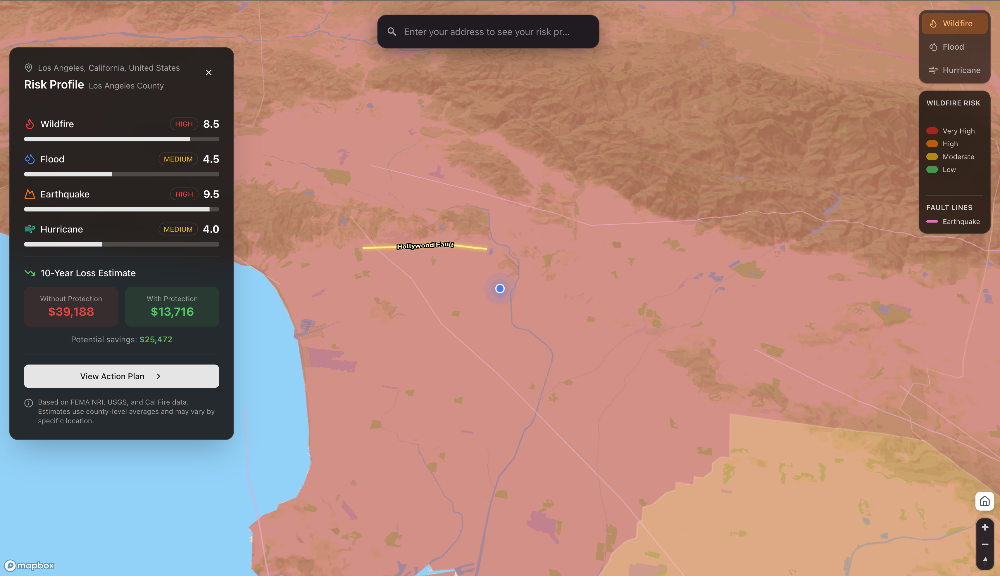

# Foresight

**Enter your address. See your risk. Know what to do.**

Foresight is a disaster preparedness tool that shows people their actual risk exposure and what they can do about it -before disaster strikes.

**Live Demo:** https://foresightv1.netlify.app/



## The Problem

Natural disasters cost the world **$368 billion** in 2024. Over 60% was uninsured -families and communities absorbed the losses alone.

Those facing the highest risk are the least prepared. In developing nations, **90% of losses are uninsured**. Even in wealthy regions, most people don't know their actual exposure until disaster strikes.

The data exists -flood maps, fault lines, fire zones, historical disasters -it's all public. But it's scattered across government PDFs, buried in technical jargon, and inaccessible to the people who need it most.

## The Solution

Foresight combines authoritative data sources into a single, accessible interface. In seconds, anyone can:

- **See their risk profile** for wildfires, floods, earthquakes, and storms on a 3D map
- **Understand why** they're at risk with plain-language explanations
- **Get prioritized actions** -free ones first
- **See estimated financial exposure** over 10 years

No jargon. No 50-page reports. No technical expertise required.

## Features

- **Interactive 3D Map** - Mapbox GL JS with terrain, risk overlays, and cinematic fly-to animations
- **Multi-Hazard Risk Assessment** - Wildfire, flood, earthquake, and hurricane risk visualization
- **Fault Line Highlighting** - Nearest fault line highlighted with distance and rupture probability
- **Personalized Risk Scores** - 0-10 scale derived from federal data sources (FEMA NRI, USGS)
- **Financial Loss Estimates** - 10-year projections comparing protected vs. unprotected scenarios
- **Action Plans** - Prioritized by timeframe (now, this week, this month) and cost (free to $500+)

## Tech Stack

- **Framework:** Next.js 15 (App Router)
- **Map:** Mapbox GL JS via react-map-gl
- **Styling:** Tailwind CSS + shadcn/ui
- **Geospatial:** Turf.js for point-in-polygon detection and distance calculations
- **Data:** GeoJSON for county boundaries and fault lines

## Data Sources

| Data | Source |
|------|--------|
| County Risk Scores | [FEMA National Risk Index](https://www.fema.gov/about/openfema/data-sets/national-risk-index-data) |
| Fault Lines | [USGS Quaternary Fault Database](https://www.usgs.gov/programs/earthquake-hazards/faults) |
| Fire Hazard Zones | [Cal Fire FHSZ](https://osfm.fire.ca.gov/divisions/community-wildfire-preparedness-and-mitigation/wildfire-preparedness/fire-hazard-severity-zones/) |
| Flood Zones | [FEMA National Flood Hazard Layer](https://www.fema.gov/flood-maps/national-flood-hazard-layer) |

## Getting Started

### Prerequisites

- Node.js 18+
- Mapbox account with access token

### Installation

```bash
# Clone the repository
git clone https://github.com/Aryagm/foresight.git
cd foresight

# Install dependencies
npm install

# Create environment file
echo "NEXT_PUBLIC_MAPBOX_TOKEN=your_mapbox_token_here" > .env.local
```

### Development

```bash
npm run dev
```

Open [http://localhost:3000](http://localhost:3000)

### Build

```bash
npm run build
```

## Architecture

```
src/
├── app/                    # Next.js App Router
├── components/
│   ├── map/               # Map components (MapContainer, RiskLayers, Legend)
│   ├── panels/            # UI panels (RiskPanel, ActionPanel)
│   └── ui/                # shadcn/ui components
├── data/                  # Static risk data (faults, county scores)
├── lib/                   # Utilities and risk calculation logic
└── public/data/           # GeoJSON files (counties, plate boundaries)
```

### Risk Calculation Flow

```
1. User enters address → Geocode to coordinates
2. Point-in-polygon → Identify county
3. Pull base risk scores from FEMA NRI data
4. Calculate fault proximity using Turf.js
5. Apply hazard-specific adjustments (slip rate, probability, zone severity)
6. Normalize to 0-10 scale with confidence indicators
7. Generate loss estimates using FEMA methodology
```

## Roadmap

- [ ] Global expansion beyond California
- [ ] Multi-language support
- [ ] Offline mode for low-connectivity areas
- [ ] Insurance coverage gap calculator
- [ ] Emergency kit checklist with local vendors
- [ ] Community preparedness scores

## Why This Matters

Resilience investment returns **3x to 12x** the cost. But resilience starts with awareness.

If 10% of at-risk households took the free actions Foresight recommends, millions would have evacuation plans, wildfire losses would drop 40%, and the insurance gap that bankrupts families would begin to close.

The information exists. Foresight makes it accessible.

## License

MIT
